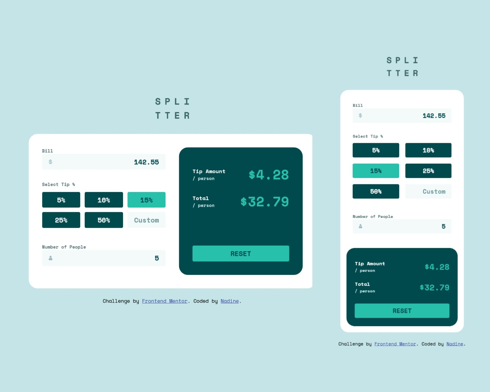

# Frontend Mentor - Tip calculator app solution

This is a solution to the [Tip calculator app challenge on Frontend Mentor](https://www.frontendmentor.io/challenges/tip-calculator-app-ugJNGbJUX). Frontend Mentor challenges help you improve your coding skills by building realistic projects.

## Table of contents

- [Overview](#overview)
  - [The challenge](#the-challenge)
  - [Screenshot](#screenshot)
  - [Links](#links)
- [My process](#my-process)
  - [Built with](#built-with)
  - [What I learned](#what-i-learned)
  - [Continued development](#continued-development)
- [Author](#author)

## Overview

### The challenge

Users should be able to:

- View the optimal layout for the app depending on their device's screen size
- See hover states for all interactive elements on the page
- Calculate the correct tip and total cost of the bill per person

### Screenshot

### Links

- Solution URL: [https://github.com/nadlgit/tip-calculator-app-main/](https://github.com/nadlgit/tip-calculator-app-main/)
- Live Site URL: [https://nadlgit.github.io/tip-calculator-app-main](https://nadlgit.github.io/tip-calculator-app-main)

## My process

### Built with

- [React](https://reactjs.org/) - JS library
- CSS custom properties
- Flexbox
- CSS Grid
- Responsive
- Mobile-first workflow

### What I learned

This is my first ReactJS project. My main learning is how to communicate between React components. The challenging part was to reset all components when clicking on reset button, with respect of encapsulation of each component.

### Continued development
- Validation of user inputs is missing: validation is done internaly but there is no feedback to user.
- CSS is still challenging for me, I guess it can be improved and optimized.

## Author

- Frontend Mentor - [@nadlgit](https://www.frontendmentor.io/profile/nadlgit)
